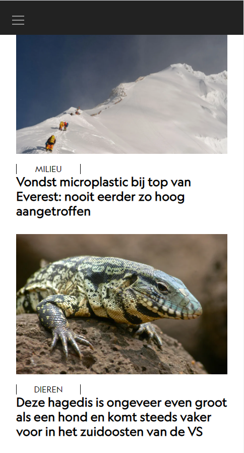
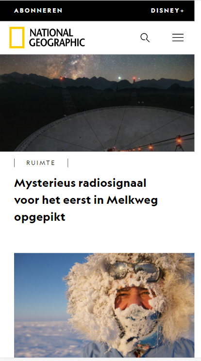
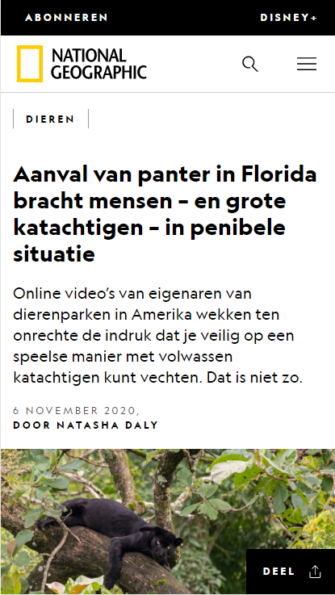

# Procesverslag
**Auteur:** -Bilal Elasri-

Markdown cheat cheet: [Hulp bij het schrijven van Markdown](https://github.com/adam-p/markdown-here/wiki/Markdown-Cheatsheet). Nb. de standaardstructuur en de spartaanse opmaak zijn helemaal prima. Het gaat om de inhoud van je procesverslag. Besteedt de tijd voor pracht en praal aan je website.

## Bronnenlijst
1. -bron 1-
2. -bron 2-
3. -...-

## Eindgesprek (week 7/8)

-dit ging goed & dit was lastig-

**Screenshot(s):**

-screenshot(s) van je eindresultaat-

## Voortgang 3 (week 6)

-same as voortgang 1-

## Voortgang 2 (week 5)

-same as voortgang 1-

## Voortgang 1 (week 3)

### Stand van zaken

-dit ging goed & dit was lastig-

**Screenshot(s):**

-screenshot(s) van hoe ver je bent met korte uitleg-

### Agenda voor meeting

-samen met je groepje opstellen-

| Daan    | Andrej         | Jeffrey    | Bilal        |
| ---            | ---     | ---          | ---              |
| Hoe zet je de navigatie vanaf de searchbutton tot winkelmand naar rechts?  | De website newgrounds.com lijkt mij toch te lastig voor een blauwe piste. Is dit een correcte observatie of lijkt dat moeilijker dan dat het is? (Surface)             | Hoe kan je een slider het beste aanmaken? ( dus afbeelding met 4 klikbare bolletjes erin om van afbeelding te switchen )    | Zijn er nog een aantal makkelijkere opdrachten om te doen voor javascript ,omdat ik javascript iets te moeilijk vindt om te doen?    |
|  | Hoe zet je een looped video op de achtergrond en kan ik bovenop die videos nog images plaatsen? |  | Ik heb een video gekeken voor een hamburger menu, deze video maakt gebruik van jquery. Mag je jquery gebruiken als je snapt wat er gebeurt? |
| ...            | Hoe goed moet je het minimale javascript onderdeel nou snappen om het te gebruiken?              | ...          | ...              |

### Verslag van meeting

-na afloop snel uitkomsten vastleggen-

## Breakdownschets (week 1)

-uitwerken voor de 1e werkgroep - eind van de eerste week-

## Intake (week 1)
-uitwerken voor de kick-off werkgroep - begin van de eerste week-

**Je startniveau:** -Rood-

**Je focus:** -Responsive-

**Je opdracht:** -https://www.nationalgeographic.nl/-

**Screenshot(s) van de eerste pagina (small screen):**

**Screenshot(s) van de tweede pagina (small screen):**

